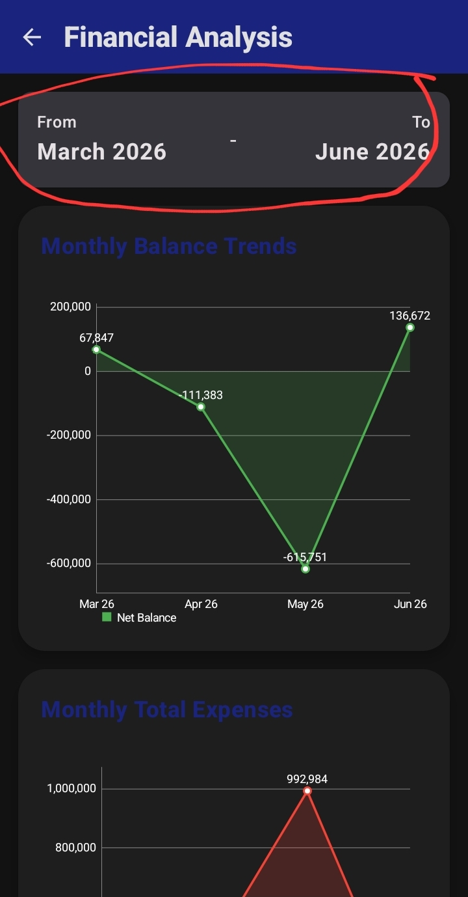
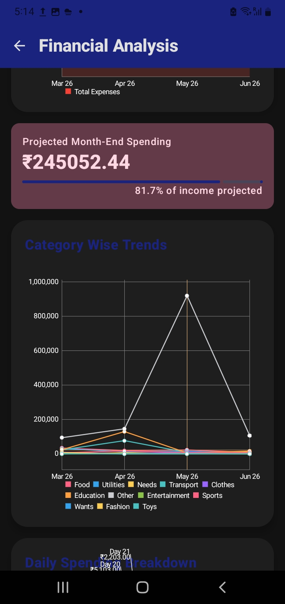
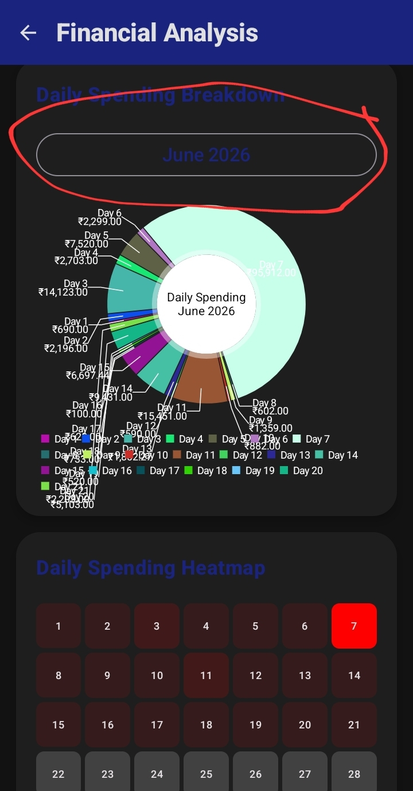

This is the help page for the Analysis Dashboard of the Expense Tracker app. The Analysis dashboard is one of the most informative screens in the app. It displays everything about your data that you need to know. In this article, we will go about every chart and graph inside it.

<table border="0" cellpadding="10" cellspacing="0" width="100%">
  <!-- Section 1 -->
  <tr>
    <td valign="top" width="60%">
      <h2>1: The Balance/ Expenses Chart:</h2>
      
These charts are exact opposites of each other. As the name suggests, they display the monthly expenses and the balance left of the monthly income till date. They have a range selector at their top, which helps to view the data of different periods. See Fig 4.1 for the charts. We have marked the range selector.

    </td>
    <td valign="top" width="40%" align="right">
      
    </td>
  </tr>
  <!-- Section 2 -->
  <tr>
    <td valign="top" width="60%">
      <h2>2: The Expense Categories Chart:</h2>
      
This chart displays expenses of each category in each month, therefore it is a multi line graph. It also works on the range selector mentioned above. See Fig 4.2 for the chart.

    </td>
    <td valign="top" width="40%" align="right">
      
    </td>
  </tr>
  <!-- Section 3 -->
  <tr>
    <td valign="top" width="60%">
      <h2>3: The Daily Spending pie chart:</h2>
      
This chart works on a month selector which displays the months for which data is available. It is a pie chart with 28/29/30/31 segments and shows each days expenses. See Fig 4.3. We have marked the month selector.

    </td>
    <td valign="top" width="40%" align="right" rowspan="2">
      
    </td>
  </tr>
  <!-- Section 4 -->
  <tr>
    <td valign="top" width="60%">
      <h2>4: Projected Spending and The Daily Spending Heatmap:</h2>
      
These charts and data show your projected expenses for this month (based on previous patterns) and the gravity of expenses per day respectively. The Daily Spending Heatmap also works on the same month selector mentioned above. It calculates the percentage of the day's expenses to the month's expenses til date and uses grey for low, dark red for medium and bright red for high spending. See Fig 4.3.

    </td>
  </tr>
</table>

