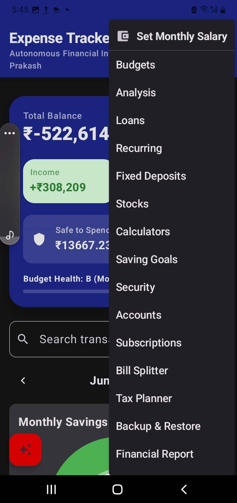
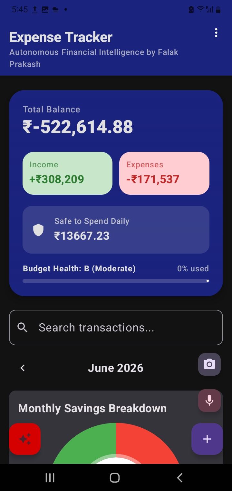
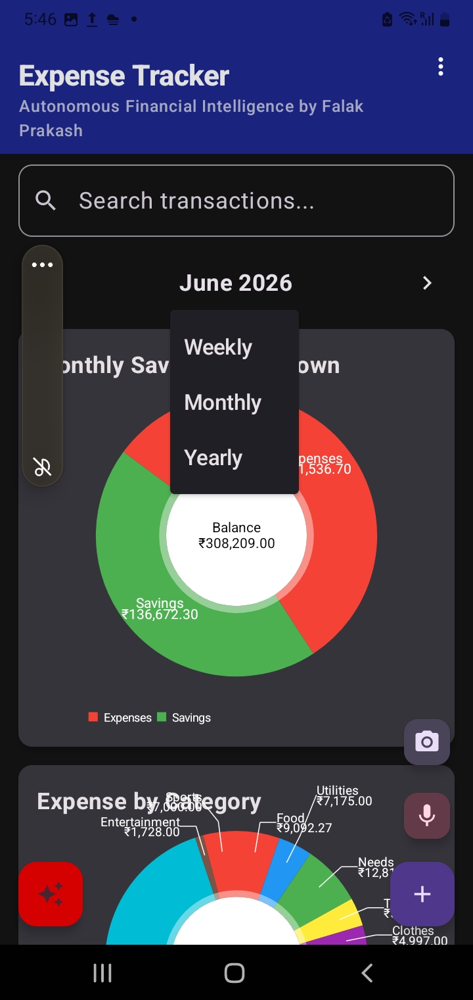

In the world of personal finance, data is only useful if it’s actionable. The Main Screen of the Expense Tracker is not just a list of transactions—it is a sophisticated dashboard designed to provide Autonomous Financial Intelligence. Every pixel is engineered to give you a clear, real-time picture of your financial health, predictive trends, and granular control over your wealth. Here is a deep dive into everything you’ll find on the primary interface.

<table border="0" cellpadding="10" cellspacing="0" width="100%">
  <!-- Row 1: The Intelligent Header text blocks + Fig 5.2 -->
  <tr>
    <td valign="top" width="60%">
      <h2>1. The Intelligent Header</h2>
      
At the very top, you are greeted by the app’s mission statement: "Autonomous Financial Intelligence by Falak Prakash."

      <h3>The Command Menu:</h3>
      
The three-dot icon provides instant access to advanced features like Loans, Stocks, Recurring Expenses, Fixed Deposits, and the Tax Planner. (see fig 5.2)

      <h3>Privacy Mode:</h3>
      
One tap allows you to toggle "Privacy Mode," instantly masking your sensitive balances and transaction amounts with asterisks (****)—perfect for checking your app in public spaces.

    </td>
    <td valign="top" width="40%" align="right" rowspan="2">
      
    </td>
  </tr>
  
  <!-- Row 2: Financial Overview Card (Shares Fig 5.2 on right, pushes down to Fig 5.1 seamlessly) -->
  <tr>
    <td valign="top" width="60%">
      <h2>2. The Financial Overview Card</h2>
      
This is the heart of the dashboard. It uses high-contrast visual cues to summarize your current standing:

      
<strong>Total Balance:</strong> A real-time calculation of your net liquidity across all accounts. (see fig 5.1)

      
<strong>Income vs. Expenses:</strong> Color-coded stats (Green for Income, Red for Expenses) that show exactly what’s flowing in and out for the selected period.

      
<strong>The "Safe to Spend" Shield:</strong> Perhaps the most intelligent feature, this metric calculates how much you can spend per day for the remainder of the month.

      
<strong>Budget Health Bar:</strong> A dynamic progress bar that changes color as you approach your limits, accompanied by a "Health Grade" (from A+ to D) that gives you an immediate grade on your spending habits.

    </td>
  </tr>

  <!-- Row 3: Predictive Insights + Fig 5.1 (Placed here so Fig 5.1 stays right next to Overview Balance references) -->
  <tr>
    <td valign="top" width="60%">
      <h2>3. Predictive Insights</h2>
      
Powered by advanced forecasting logic, the Predictive Insights section appears when the app detects a pattern.

      
<strong>Smart Alerts:</strong> It might tell you, "Next month you might spend ₹5,000 on Food based on your current trends."

      
<strong>Conflict Resolver:</strong> If you use the app on multiple devices, the main screen will intelligently alert you to "Sync Conflicts," allowing you to choose which version of your data to keep.

    </td>
    <td valign="top" width="40%" align="right">
      
    </td>
  </tr>

  <!-- Row 4: Period Selector & Visualizations + Fig 5.3 -->
  <tr>
    <td valign="top" width="60%">
      <h2>4. Multi-Dimensional Period Selector</h2>
      
Whether you want to look at the big picture or zoom in on the details, the Period Selector lets you switch between: (see fig 5.3)

      <ul>
        <li><strong>Weekly:</strong> For short-term cash flow management.</li>
        <li><strong>Monthly:</strong> For standard budgeting and goal tracking.</li>
        <li><strong>Yearly:</strong> For long-term wealth analysis.</li>
      </ul>
      <h2>5. Data Visualization (Adaptive Charts)</h2>
      
We believe in exact data, not "guesstimates." Our charts feature: (see fig 5.2)

      <ul>
        <li><strong>Exact Value Formatting:</strong> Every pie chart slice shows your data down to two decimal places for 100% accuracy.</li>
        <li><strong>Intelligent Legends:</strong> Chart keys now support word-wrapping, ensuring that long category names are never cut off.</li>
        <li><strong>Categorical Breakdowns:</strong> Separate charts for "Savings Breakdown," "Expenses by Category," and "Credits by Category" give you a 360-degree view of your habits.</li>
      </ul>
    </td>
    <td valign="top" width="40%" align="right" rowspan="2">
      
    </td>
  </tr>

  <!-- Row 5: Transaction Management (Shares Fig 5.3 column placement) -->
  <tr>
    <td valign="top" width="60%">
      <h2>6. High-Speed Transaction Management</h2>
      
<strong>Quick Add Section:</strong> Record a transaction in seconds. It includes a built-in Calculator and a Category Suggester that learns your habits over time. (see fig 5.2, we have marked the buttons)

      
<strong>Receipt Scanning:</strong> Tap the camera icon to use AI-powered OCR to read physical receipts and automatically populate your transaction details.

      
<strong>Transaction History:</strong> A beautiful, icon-driven list of your history. (see fig 5.3)

      
<strong>Swipe-to-Delete:</strong> Effortlessly manage your records with intuitive gestures.

      
<strong>Search & Filters:</strong> Search by name, category, or even amount (e.g., searching "&gt; 500" to see all large transactions).

    </td>
  </tr>
</table>

## 7. The AI Assistant (Groq Integration); see article 4
In the bottom-left corner sits the Auto-Awesome FAB. This is your gateway to our AI Chatbot. Built on the Groq engine, you can ask it complex questions like "Can I afford a new laptop next month?" or "Analyze my spending on utilities over the last year," and get an intelligent, human-like response based on your real data.

## 8. Real-Time Cloud Synchronization; see article 6
Behind the scenes, the Main Screen is constantly talking to the cloud. Using a Parallel Sync Engine, the app updates your data across Realtime Database and Cloud Firestore simultaneously. This ensures that whether you’re on your phone or tablet, your financial intelligence is always up to date with zero lag.

## Why It Matters
The Main Screen is designed to move you from passive tracking to active intelligence. By combining beautiful UI with predictive analytics and high-speed data entry, Falak Prakash’s Expense Tracker ensures that you aren't just seeing where your money went—you're seeing where it's going.
