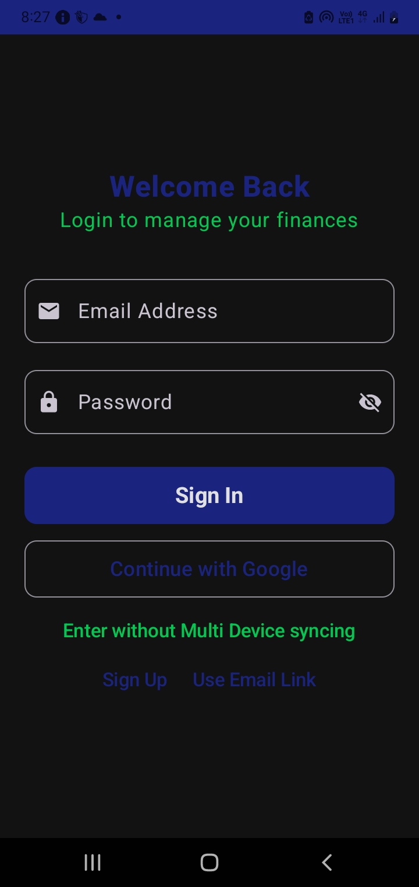

# Our Login Feature

In this world of economics, keeping your data to yourself is very important. This app has a 'Login' feature to implement sync (see article 6). 

<table border="0" cellpadding="10" cellspacing="0" width="100%" style="border-collapse: collapse;">
  <tr>
    <td valign="top" width="60%" style="padding: 10px;">
      
The Login Screen is shown in <strong>fig 7.1</strong>. This screen features Sign In, Sign Up and Continue with Google (sign-in). You are familiar with these terms.

      
Accounts are stored in Firebase. If you have a Google account on your phone, it will instantly login by it. If not, sign up and set your Email and Password (Please note that there is no way to retrieve a password).

      
It also includes 'Enter without multi-device sync' which does not login the user, directly takes them to the main screen of the app.

    </td>
    <td valign="middle" width="40%" align="right" style="padding: 0;">
      
    </td>
  </tr>
</table>

## 'No Credentials found'/ 'Credentials Missing'
This app requires Google Play Services on your phone to be at the highest version. If you encounter this error while trying to sign-in with Google, you have to update Google Play Services. If it is done, update Android OS. If that does not work, check your Google Account Settings and see if it allows third-party app Sign-in.
