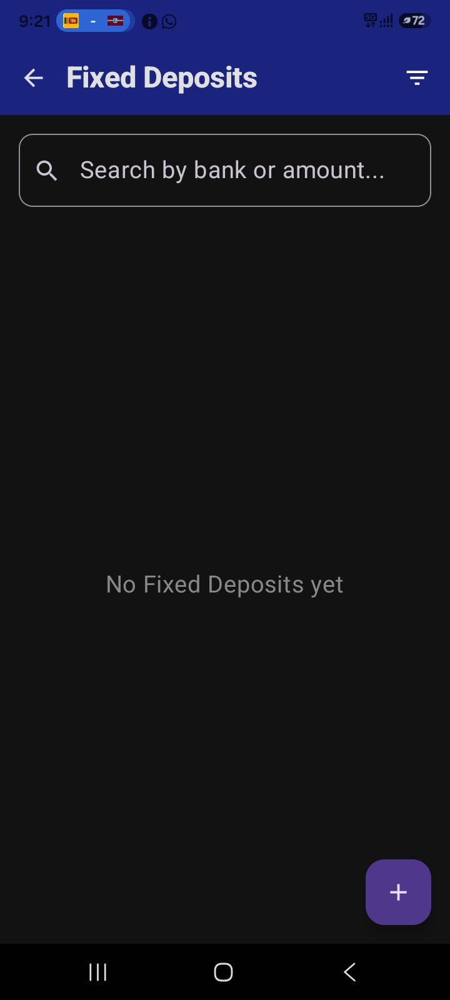
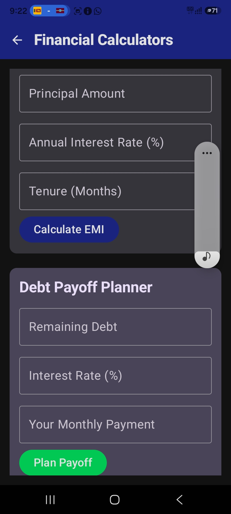
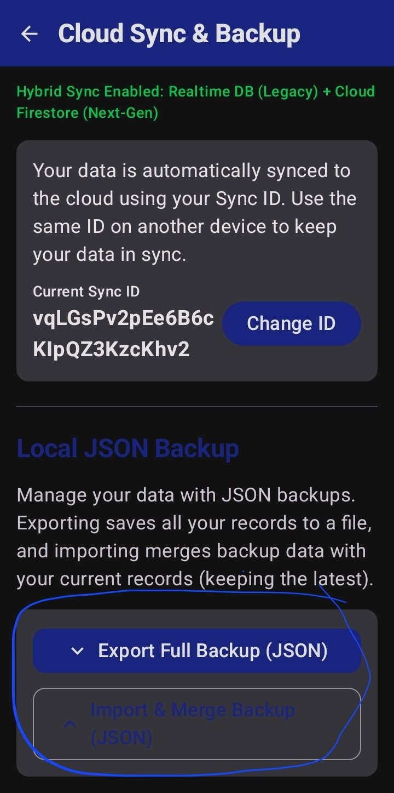
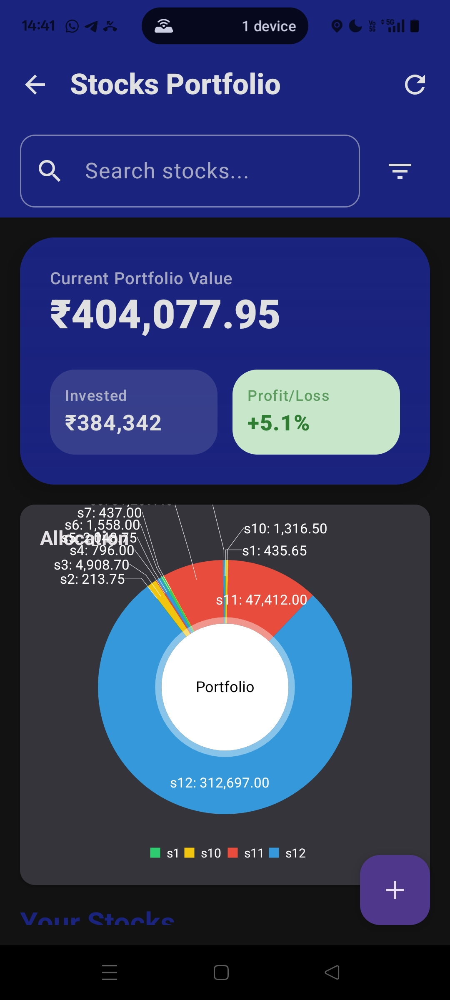

<table>
  <thead>
    <tr>
      <th style="width: 20%; text-align: left;">Feature</th>
      <th style="width: 50%; text-align: left;">Description</th>
      <th style="width: 30%; text-align: center;">Visual</th>
    </tr>
  </thead>
  <tbody>
    <tr>
      <td><strong>Budgets</strong></td>
      <td>We have budget option in the main menu, accesible by the main screen. The budget screen is shown alongside. As the name suggests, it is used to add budgets for the different categories of expenses defined in the app for each month. On top is a date picker that we have marked. See Fig 8.1.</td>
      <td style="padding: 0; text-align: center; vertical-align: middle;">
        
      </td>
    </tr>
    <tr>
      <td rowspan="2"><strong>Loans</strong></td>
      <td>This app also has a Loan tracker feature, as it comes under the broad ambit of expense tracking. On opening the Loan Main screen from the main menu, you see a list of your loans. You can also add loans using the add button in the bottom right corner, marked in Fig 8.2. That opens an add loan dialog box, which asks the term of the loan, interest compounded monthly and the principle.</td>
      <td style="padding: 0; text-align: center; vertical-align: middle;">
        
      </td>
    </tr>
    <tr>
      <td>To add a payment or edit a loan, click on it. The Screen that opens is shown in Fig 8.3. On the top, there are buttons to delete the loan and edit the parameters mentioned above. To add a payment, scroll to the add payment box, type the amount and hit Enter. It will be autosaved with the given date. A list of previous payments follows.</td>
      <td style="padding: 0; text-align: center; vertical-align: middle;">
        
      </td>
    </tr>
    <tr>
      <td><strong>Stocks</strong></td>
      <td>This app's Stosks feature is quite advanced for its level. Although you cannot buy, sell or trade stocks using this app, like a regular stock trader like Kite. but you can see the loss or profit of your stocks. This app uses the Yahoo Finance API. On opening the Stock Screen via the Main Menu, you see a portfolio of your stocks. You can search them and sort&amp;filter them according to your criteria. A reload option refetches the stock prices from the net again, if you want it to refresh. See Fig 8.4, we have marked the reload button.</td>
      <td style="padding: 0; text-align: center; vertical-align: middle;">
        
      </td>
    </tr>
  </tbody>
</table>
